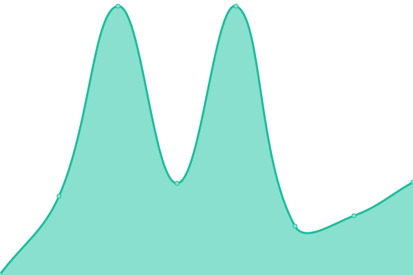

# [📈 Live Status](https://w6cC5cP74g9c.github.io/up): <!--live status--> **🟧 Partial outage**

This repository contains the open-source uptime monitor and status page for [w6cC5cP74g9c](https://w6cC5cP74g9c.github.io/up), powered by [Upptime](https://github.com/upptime/upptime).

With [Upptime](https://upptime.js.org), you can get your own RFUMS unlimited and free uptime monitor and status page, powered entirely by a GitHub repository. We use [Issues](https://github.com/w6cC5cP74g9c/up/issues) as incident reports, [Actions](https://github.com/w6cC5cP74g9c/up/actions) as uptime monitors, and [Pages](https://w6cC5cP74g9c.github.io/up) for the status page.

<!--start: status pages-->
<!-- This summary is generated by Upptime (https://github.com/upptime/upptime) -->
<!-- Do not edit this manually, your changes will be overwritten -->
<!-- prettier-ignore -->
| URL | Status | History | Response Time | Uptime |
| --- | ------ | ------- | ------------- | ------ |
|  [RosalindFranklin WebSite](https://www.rosalindfranklin.edu) | 🟩 Up | [rosalind-franklin-web-site.yml](https://github.com/w6cC5cP74g9c/up/commits/HEAD/history/rosalind-franklin-web-site.yml) | 

 226ms
     
 | 

<a href="https://w6cC5cP74g9c.github.io/up/history/rosalind-franklin-web-site">100.00%</a>
    

|  [ADP](https://workforcenow.adp.com/) | 🟩 Up | [adp.yml](https://github.com/w6cC5cP74g9c/up/commits/HEAD/history/adp.yml) | 

 556ms
     
 | 

<a href="https://w6cC5cP74g9c.github.io/up/history/adp">100.00%</a>
    

|  [Athena Health](https://identity.athenahealth.com/) | 🟩 Up | [athena-health.yml](https://github.com/w6cC5cP74g9c/up/commits/HEAD/history/athena-health.yml) | 

 521ms
     
 | 

<a href="https://w6cC5cP74g9c.github.io/up/history/athena-health">100.00%</a>
    

|  [Boxer Library](https://www.rosalindfranklin.edu/Library/) | 🟩 Up | [boxer-library.yml](https://github.com/w6cC5cP74g9c/up/commits/HEAD/history/boxer-library.yml) | 

 24ms
     
 | 

<a href="https://w6cC5cP74g9c.github.io/up/history/boxer-library">100.00%</a>
    

|  [CastleBranch](https://discover.castlebranch.com/) | 🟩 Up | [castle-branch.yml](https://github.com/w6cC5cP74g9c/up/commits/HEAD/history/castle-branch.yml) | 

 1649ms
     
 | 

<a href="https://w6cC5cP74g9c.github.io/up/history/castle-branch">100.00%</a>
    

|  [IPv6 test](forwardemail.net) | 🟥 Down | [i-pv6-test.yml](https://github.com/w6cC5cP74g9c/up/commits/HEAD/history/i-pv6-test.yml) | 

 0ms
     
 | 

<a href="https://w6cC5cP74g9c.github.io/up/history/i-pv6-test">100.00%</a>
    

<!--end: status pages-->

[**Visit our status website →**](https://w6cC5cP74g9c.github.io/up)

## 📄 License

- Powered by: [Upptime](https://github.com/upptime/upptime)
- Code: [MIT](./LICENSE) © [Anand Chowdhary](https://anandchowdhary.com), supported by [Pabio](https://pabio.com)
- Data in the `./history` directory: [Open Database License](https://opendatacommons.org/licenses/odbl/1-0/)
