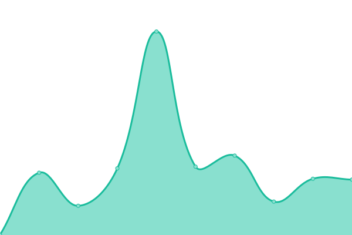

# [📈 Live Status](](https://uptime.rosalindfranklin.edu/): <!--live status--> **🟧 Partial outage**

This repository contains the open-source uptime monitor and status page for [RFUMS](https://uptime.rosalindfranklin.edu), powered by [Upptime](https://github.com/upptime/upptime).

With [Upptime](https://upptime.js.org), you can get your own RFUMS unlimited and free uptime monitor and status page, powered entirely by a GitHub repository. We use [Issues](https://github.com/w6cC5cP74g9c/up/issues) as incident reports, [Actions](https://github.com/w6cC5cP74g9c/up/actions) as uptime monitors, and [Pages](https://uptime.rosalindfranklin.edu/) for the status page.

<!--start: status pages-->
<!-- This summary is generated by Upptime (https://github.com/upptime/upptime) -->
<!-- Do not edit this manually, your changes will be overwritten -->
<!-- prettier-ignore -->
| URL | Status | History | Response Time | Uptime |
| --- | ------ | ------- | ------------- | ------ |
|  [Rosalind Franklin University Network](https://selfservice.rosalindfranklin.edu/Student/Account/Login) | 🟩 Up | [rosalind-franklin-university-network.yml](https://github.com/RosalindFranklinUniv/up/commits/HEAD/history/rosalind-franklin-university-network.yml) | 

 322ms
     
 | 

<a href="https://uptime.rosalindfranklin.edu/history/rosalind-franklin-university-network">100.00%</a>
    

|  [ADP](https://workforcenow.adp.com/) | 🟩 Up | [adp.yml](https://github.com/RosalindFranklinUniv/up/commits/HEAD/history/adp.yml) | 

 494ms
     
 | 

<a href="https://uptime.rosalindfranklin.edu/history/adp">100.00%</a>
    

|  [Athena Health](https://identity.athenahealth.com/) | 🟩 Up | [athena-health.yml](https://github.com/RosalindFranklinUniv/up/commits/HEAD/history/athena-health.yml) | 

 449ms
     
 | 

<a href="https://uptime.rosalindfranklin.edu/history/athena-health">100.00%</a>
    

|  [Boxer Library](https://www.rosalindfranklin.edu/Library/) | 🟩 Up | [boxer-library.yml](https://github.com/RosalindFranklinUniv/up/commits/HEAD/history/boxer-library.yml) | 

 205ms
     
 | 

<a href="https://uptime.rosalindfranklin.edu/history/boxer-library">100.00%</a>
    

|  [CastleBranch](https://discover.castlebranch.com/) | 🟩 Up | [castle-branch.yml](https://github.com/RosalindFranklinUniv/up/commits/HEAD/history/castle-branch.yml) | 

 1387ms
     
 | 

<a href="https://uptime.rosalindfranklin.edu/history/castle-branch">100.00%</a>
    

|  [COI Smart](https://rosalindfranklin.coi-smart.com/) | 🟩 Up | [coi-smart.yml](https://github.com/RosalindFranklinUniv/up/commits/HEAD/history/coi-smart.yml) | 

 539ms
     
 | 

<a href="https://uptime.rosalindfranklin.edu/history/coi-smart">100.00%</a>
    

|  [D2L Brightspace](https://d2l.rosalindfranklin.edu/d2l/home) | 🟩 Up | [d2-l-brightspace.yml](https://github.com/RosalindFranklinUniv/up/commits/HEAD/history/d2-l-brightspace.yml) | 

 291ms
     
 | 

<a href="https://uptime.rosalindfranklin.edu/history/d2-l-brightspace">100.00%</a>
    

|  [Engage](https://rosalindfranklin.campuslabs.com/engage) | 🟩 Up | [engage.yml](https://github.com/RosalindFranklinUniv/up/commits/HEAD/history/engage.yml) | 

 272ms
     
 | 

<a href="https://uptime.rosalindfranklin.edu/history/engage">100.00%</a>
    

|  [Exxat PRISM](https://auth.rosalindfranklin.edu/auth/realms/rfu/protocol/saml/clients/ExxatPRISM) | 🟩 Up | [exxat-prism.yml](https://github.com/RosalindFranklinUniv/up/commits/HEAD/history/exxat-prism.yml) | 

 91ms
     
 | 

<a href="https://uptime.rosalindfranklin.edu/history/exxat-prism">100.00%</a>
    

|  [Exxat V.3](https://apps.exxat.com/Fusion/Account/Login?ReturnUrl=%2f) | 🟩 Up | [exxat-v-3.yml](https://github.com/RosalindFranklinUniv/up/commits/HEAD/history/exxat-v-3.yml) | 

 295ms
     
 | 

<a href="https://uptime.rosalindfranklin.edu/history/exxat-v-3">100.00%</a>
    

|  [Test System](https://apps.estestsystemdownxxat.com/Fusion/Account/Login?ReturnUrl=%2f) | 🟥 Down | [test-system.yml](https://github.com/RosalindFranklinUniv/up/commits/HEAD/history/test-system.yml) | 

 0ms
     
 | 

<a href="https://uptime.rosalindfranklin.edu/history/test-system">0.00%</a>
    

|  [Helixcard WebPay](https://webpay.rosalindfranklin.edu/webdeposit/) | 🟩 Up | [helixcard-web-pay.yml](https://github.com/RosalindFranklinUniv/up/commits/HEAD/history/helixcard-web-pay.yml) | 

 1473ms
     
 | 

<a href="https://uptime.rosalindfranklin.edu/history/helixcard-web-pay">100.00%</a>
    

|  [IM Leagues](https://www.imleagues.com/SSOSignUp.aspx) | 🟩 Up | [im-leagues.yml](https://github.com/RosalindFranklinUniv/up/commits/HEAD/history/im-leagues.yml) | 

 411ms
     
 | 

<a href="https://uptime.rosalindfranklin.edu/history/im-leagues">85.72%</a>
    

|  [Interfolio](https://home.interfolio.com/14700) | 🟩 Up | [interfolio.yml](https://github.com/RosalindFranklinUniv/up/commits/HEAD/history/interfolio.yml) | 

 154ms
     
 | 

<a href="https://uptime.rosalindfranklin.edu/history/interfolio">100.00%</a>
    

|  [ITS Help Desk](https://support.rosalindfranklin.edu/?format=portal) | 🟩 Up | [its-help-desk.yml](https://github.com/RosalindFranklinUniv/up/commits/HEAD/history/its-help-desk.yml) | 

 651ms
     
 | 

<a href="https://uptime.rosalindfranklin.edu/history/its-help-desk">100.00%</a>
    

|  [KnowBe4](https://training.knowbe4.com/) | 🟩 Up | [know-be4.yml](https://github.com/RosalindFranklinUniv/up/commits/HEAD/history/know-be4.yml) | 

 308ms
     
 | 

<a href="https://uptime.rosalindfranklin.edu/history/know-be4">100.00%</a>
    

|  [Maxient](https://cm.maxient.com/) | 🟩 Up | [maxient.yml](https://github.com/RosalindFranklinUniv/up/commits/HEAD/history/maxient.yml) | 

 170ms
     
 | 

<a href="https://uptime.rosalindfranklin.edu/history/maxient">100.00%</a>
    

|  [Med+Proctor](https://secure.medproctor.com/) | 🟩 Up | [med-proctor.yml](https://github.com/RosalindFranklinUniv/up/commits/HEAD/history/med-proctor.yml) | 

 323ms
     
 | 

<a href="https://uptime.rosalindfranklin.edu/history/med-proctor">100.00%</a>
    

|  [One45](https://rfums-cms.one45.com/) | 🟩 Up | [one45.yml](https://github.com/RosalindFranklinUniv/up/commits/HEAD/history/one45.yml) | 

 557ms
     
 | 

<a href="https://uptime.rosalindfranklin.edu/history/one45">100.00%</a>
    

|  [Panopto](https://rosalindfranklin.hosted.panopto.com/) | 🟩 Up | [panopto.yml](https://github.com/RosalindFranklinUniv/up/commits/HEAD/history/panopto.yml) | 

 380ms
     
 | 

<a href="https://uptime.rosalindfranklin.edu/history/panopto">100.00%</a>
    

|  [Poll Everywhere](https://id.polleverywhere.com/) | 🟩 Up | [poll-everywhere.yml](https://github.com/RosalindFranklinUniv/up/commits/HEAD/history/poll-everywhere.yml) | 

 480ms
     
 | 

<a href="https://uptime.rosalindfranklin.edu/history/poll-everywhere">100.00%</a>
    

|  [Risk Management](https://www.lossfreerx.com/) | 🟩 Up | [risk-management.yml](https://github.com/RosalindFranklinUniv/up/commits/HEAD/history/risk-management.yml) | 

 321ms
     
 | 

<a href="https://uptime.rosalindfranklin.edu/history/risk-management">100.00%</a>
    

|  [SAP Concur](https://us2.concursolutions.com/home) | 🟩 Up | [sap-concur.yml](https://github.com/RosalindFranklinUniv/up/commits/HEAD/history/sap-concur.yml) | 

 467ms
     
 | 

<a href="https://uptime.rosalindfranklin.edu/history/sap-concur">100.00%</a>
    

|  [Self-Service](https://selfservice.rosalindfranklin.edu/Student/Account/Login) | 🟩 Up | [self-service.yml](https://github.com/RosalindFranklinUniv/up/commits/HEAD/history/self-service.yml) | 

 238ms
     
 | 

<a href="https://uptime.rosalindfranklin.edu/history/self-service">100.00%</a>
    

|  [Tutoring Appointments](https://rfu.mywconline.com/register) | 🟩 Up | [tutoring-appointments.yml](https://github.com/RosalindFranklinUniv/up/commits/HEAD/history/tutoring-appointments.yml) | 

 528ms
     
 | 

<a href="https://uptime.rosalindfranklin.edu/history/tutoring-appointments">100.00%</a>
    

|  [Workday](https://login.adaptiveinsights.com/) | 🟩 Up | [workday.yml](https://github.com/RosalindFranklinUniv/up/commits/HEAD/history/workday.yml) | 

 450ms
     
 | 

<a href="https://uptime.rosalindfranklin.edu/history/workday">100.00%</a>
    

|  [Zoom](https://rosalindfranklin.zoom.us/) | 🟩 Up | [zoom.yml](https://github.com/RosalindFranklinUniv/up/commits/HEAD/history/zoom.yml) | 

 144ms
     
 | 

<a href="https://uptime.rosalindfranklin.edu/history/zoom">100.00%</a>
    

<!--end: status pages-->

[**Visit our status website →**](https://w6cC5cP74g9c.github.io/up)

## 📄 License

- Powered by: [Upptime](https://github.com/upptime/upptime)
- Code: [MIT](./LICENSE) © [Anand Chowdhary](https://anandchowdhary.com), supported by [Pabio](https://pabio.com)
- Data in the `./history` directory: [Open Database License](https://opendatacommons.org/licenses/odbl/1-0/)
